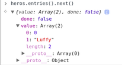

# [`Iterables`](https://developer.mozilla.org/fr/docs/Web/JavaScript/Reference/Les_protocoles_iteration) & [`Looping`](https://developer.mozilla.org/fr/docs/Web/JavaScript/Guide/Boucles_et_it%C3%A9ration)

## ``For ...``

J'imagine que tu as déjà vu ce genre de boucle :
```js
const heros = ['Luffy', 'Naruto', 'Light', 'Sakuragi']

for (let i = 0; i < heros.length; i++) {
    console.log(heros[i])
}
```
## ``forEach``
Je te présente la boucle `forEach` :
```js
const heros = ['Luffy', 'Naruto', 'Light', 'Sakuragi']

heros.forEach(hero => console.log(hero))
```

Si tu l'utilises, tu n'auras pas le droit à ```break``` et ```continue``` :
```js
heros.forEach(hero => {
  if (hero === 'Light') {
    console.log('STOP')
    break // SyntaxError: Illegal break statement
  }
  console.log(hero) 
})
```
## ``for ..in``
Il y a également le ```for ..in``` :
```js
for (const index in heros) {
    console.log(heros[index])
}
```

Mais je le déconseille car : 
```js
// De nombreuses librairies modifient les prototypes comme par exemple ici :
Array.prototype.shuffle = function() {
     var i = this.length, j, temp
     if ( i == 0 ) return this
     while ( --i ) {
      j = Math.floor( Math.random() * ( i + 1 ) )
      temp = this[i]
      this[i] = this[j]
      this[j] = temp
    }
    return this
}

for (const index in heros) {
    console.log(heros[index])
}
// Luffy
// Naruto
// Light
// Sakuragi
// [Function]
```
## ``for ..of``
Sinon il y a le ```for ..of``` qui est plutôt cool, puisque ce dernier autorise ```break``` et n'affiche pas les *prototypes* modifiés :

```js
for (const hero of heros) {
  if (hero === 'Light') {
    break
  }
  console.log(hero)
}
// Luffy
// Naruto
```
Pour parcourir un objet avec un ```for ..of```, tu peux utiliser la méthode ```Object.keys```

```js
const pomme = {
  couleur: 'rouge',
  provenance : 'espagne',
  juteuse : true
}

for (const prop of Object.keys(pomme)) {
  console.log(prop, ':' ,pomme[prop])
}
// couleur : rouge
// provenance : espagne
// juteuse : true
```

## Iterables
> Si tu viens de Java, tu dois connaître les iterators.

Un objet est un **itérable** lorsqu'il implémente une fonction ``next()``. Cette dernière retourne un objet qui contient deux propriétés:
- ``value`` : valeur actuelle de l'exécution en cours
- ``done`` : un booléen qui indique si l'itération est terminée ou non

Les appels successifs de ``next()`` permettront d'obtenir toutes les valeurs d'un objet. Voyons comment nous pouvons itérer sur un tableau simple ['a', 'b']:
```js
iteratorArray.next();
// -> Object {value: "a", done: false}
iteratorArray.next();
// -> Object {value: "b", done: false}
iteratorArray.next();
// -> Object {value: undefined, done: true}
```

Donc, vous allez probablement demander maintenant *"Comment obtenir cet Iterator?"*. 
Eh bien il suffit d'utiliser l'une de ces fonctions :

- ``entries ()`` renvoie un ensemble de clés / valeurs
- ``keys ()`` renvoie les clés
- ``values ​​()`` renvoie des valeurs

> ``Object.keys(monObjet)`` et ``Object.entries(monObjet)`` dans le cas d'un ``Object``. ``monArray.entries()`` dans le cas d'un tableau.

Exemple : 
```js
const obj = { a: 1, b: 2 }

console.log(Object.keys(obj)) // [ 'a', 'b' ]
console.log(Object.values(obj)) // [ 1, 2 ]
console.log(Object.entries(obj)) // [ [ 'a', 1 ], [ 'b', 2 ] ]
```
Beaucoup de concept de JavaScript profite de ce protocole: boucles, spread, générateurs, destructuring... Il est donc important de le comprendre.

### Array

Maintenant comment récupérer l'index avec un ```for ..of``` ? Spoiler: on peut utiliser **array.entries()** :



```js
const heros = ['Luffy', 'Naruto', 'Light', 'Sakuragi']

for (const hero of heros.entries()) {
  console.log(hero)
}
// [ 0, 'Luffy' ]
// [ 1, 'Naruto' ]
// [ 2, 'Light' ]
// [ 3, 'Sakuragi' ]
for (const hero of heros.entries()) {
  console.log(hero[0] + ' - ' + hero[1])
}
// 0 - Luffy
// 1 - Naruto
// 2 - Light
// 3 - Sakuragi

// On peut aussi destructurer le heros.entries() :
for (const [i, hero] of heros.entries()) {
  console.log(i + ' - ' + hero)
}
// 0 - Luffy
// 1 - Naruto
// 2 - Light
// 3 - Sakuragi
```
## Liens utiles 
- [Iteration Protocol](http://putaindecode.io/en/articles/js/es2015/iterators/)
- [Iterables et itérateurs dans ECMAScript 6](http://2ality.com/2015/02/es6-iteration.html)
- [Protocoles d'itération](https://developer.mozilla.org/fr/docs/Web/JavaScript/Reference/Les_protocoles_iteration)
- [ES6 en profondeur: itérateurs et pour de la boucle](https://hacks.mozilla.org/2015/04/es6-in-depth-iterators-and-the-for-of-loop/)
- [Les itérateurs ES6 en profondeur](https://ponyfoo.com/articles/es6-iterators-in-depth)
