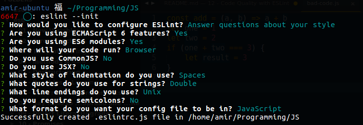

# [`ESLINT`](https://eslint.org/)

Le linting (**"linter"** son code) est une pratique qui vise à **améliorer la qualité de votre code** et de ce fait la **reprise** et la **maintenabilité** de celui-ci.

*Un développeur peut créer une application qui fonctionne en la codant comme un gros porc.*

Au cours de ma Piscine à 42, nous les *piscineux* étions obligé d'utiliser ce qu'on appelle la [`Norme`](https://ncoden.fr/datas/42/norm.pdf). Sinon, la `Moulinette`, *le programme qui corrigeait nos exercices*, nous mettait 0 d'office. Ainsi lorsque l'on devait corriger ou travailler avec quelqu'un, relire son code et essayer de le comprendre fut d'autant plus facile.

Celà peut paraître chiant, voir inutile, mais croyez moi, ce n'est pas toujours simple quand on bosse sur de gros projets en équipe de repasser et d'utiliser ce que les autres ont écris.

Enfin bref, **ESLint** est un linteur, il aide les développeurs JavaScript à produire du code propre (*des linteurs existent dans quasiment tous les langages et ils peuvent parfois être directement implémentés dans vos IDE.*). 

Par exemple, le linteur détectera :
- les variables qui n'existent pas
- les variables inutilisées
- les doubles déclarations de variables, de fonctions, etc...
- la mauvaise organisation du code
- le non respect des bonnes pratiques d'écriture de code
- les erreurs de syntaxe

>**Attention**: à ne pas confondre avec un débuggeur, qui lui analyse le code lors de son exécution.

Rien ne vaut une [démo](https://eslint.org/demo/)

## Comment l'utiliser ?

>Installez node et npm si ce n'est pas déjà fait. Ensuite, tapez la commande `npm install -g eslint`.

La première fois, lancez `eslint --init`, il vous posera des questions de ce genre :


Maintenant lancez `eslint filename.js`, vous obtiendrez les erreurs :


Vous pouvez dès à présent mettre vos configurations dans un fichier `.eslintrc` à la racine de votre projet.

>Vous pouvez aussi le faire globalement, mais vu que les projets n'ont pas tous le même *code-style*, je vous invite à le faire projet par projet. Toutefois placez en un dans votre dossier *home*, il agira sur vos fichiers par défaut.

On peut imposer plusieurs [règles](https://eslint.org/docs/rules/) à nos fichiers. Elles peuvent être dans l'un de ces 3 états : off(0), warning(1) et error(2).

Exemple :
```json
{
    "env" : {
        "es6" : true,
        "browser" : true
    },
    "extends" : "eslint:recommended",
    "rules" : {
        "no-console" : 0
    }
}
```
> j'aurais aussi pu mettre "off" à la place de 0

## Airbnb ESLint paramètres

Heureusement, vous n'avez pas besin de tout réécrire. 

Les ingénieurs de AirBnB ont rédigé ce petit [Javascript Style Guide](https://github.com/airbnb/javascript) qui décrit comment respecter l'ES6 d'une manière cohérente à travers tous vos projets. Dans leur repo, on retrouve un `.eslintrc`. Pour l'implémenter, il vous suffira de :
1. `npm install --g eslint-config-airbnb eslint eslint-plugin-jsx-a11y eslint-plugin-import eslint-plugin-react`
2. changer cette ligne :
```json
    "extends" : "airbnb",
```

Bien sûr, vous pourrez par la suite enlever les règles avec lesquels vous n'êtes pas d'accord en les mettant sur off(0).

## Paramètres spécifiques à votre fichier

Maintenant si vous récupérez un bout de code sur le net, vous savez qu'ils fonctionnent et vous pas envie de corriger son style. Vous pouvez ajouter des commentaires dans votre `fichier.js` comme ceci :
```js
/* eslint-disable */
// ... portion de code ignorée par eslint
/* eslint-enable */
```

## ESLint Plugins

Il y a également ce repo [awesome-eslint](https://github.com/dustinspecker/awesome-eslint) dans lequel figure un tas de plugins pour ESLint, qui s'adapte au type de JS vous écrivez (Node, React, JS dans du HTML / Markdown ...).

Exemple :
1. `npm install -g eslint-plugin-html`
Il vous faudra simplement ajouter cette ligne :
```json
    "plugins" : ["html"]
```

Enfin vous trouverez votre bonheur avec `eslint --help` (comme `eslint --fix` par exemple).

## ESLint sur SublimeText

Installez `SublimeLinter` et `SublimeLinter-contrib-eslint` en cherchant `sublime linter eslint ` dans le `Package Control`. 

>Il faut avoir eslint installer globalement

Je conseille de le lancer toutes les fois où vous sauvegardez vos fichiers. Pour celà, tapez `Ctrl + Shift + P`, chercher `sublimelinter`, choisissez `SublimeLinter: Choose Lint Mode` et là descendez jusqu'à `Save Only`.

## ESLint sur ATOM

Allez dans les `Settings`, installez `linter` et `linter-eslint`

## Autoriser uniquement le code passé par ESLint dans votre repo git

Très utile, si vous travaillez en équipe.

Allez dans le dossier `.git` de votre repo, vous y trouverez un dossier appelé `hooks`. Changez le fichier `commit-msg.sample` en `commit-msg` et remplacer  le contenu par le texte suivant : 

```sh
#!/bin/bash
files=$(git diff --cached --name-only | grep '\.jsx\?$')

# Prevent ESLint help message if no files matched
if [[ $files = "" ]] ; then
  exit 0
fi

failed=0
for file in ${files}; do
  git show :$file | eslint $file
  if [[ $? != 0 ]] ; then
    failed=1
  fi
done;
 
if [[ $failed != 0 ]] ; then
  echo "🚫🚫🚫 ESLint failed, git commit denied!"
  exit $failed
fi
```
